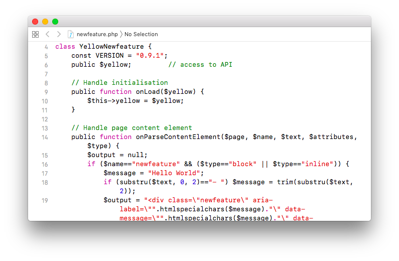

<a href="README-de.md">Deutsch</a> &nbsp; <a href="README.md">English</a> &nbsp; <a href="README-sv.md">Svenska</a>

# Publish 0.8.70

Göra och publicera tillägg.

## Hur man installerar ett tillägg

[Ladda ner ZIP-filen](https://github.com/annaesvensson/yellow-publish/archive/refs/heads/main.zip) och kopiera den till din `system/extensions` mapp. [Läs mer om tillägg](https://github.com/annaesvensson/yellow-update/tree/main/README-sv.md).

## Hur man gör ett tillägg

[Börja med en exempel funktion](https://github.com/schulle4u/yellow-extension-helloworld). Det är bäst att titta på koden för några tillägg in din `system/extensions` mapp. Gör dig bekant med våra kodnings- och dokumentationsstandarder. Sen kan du dyka in i vilket tillägg som helst och hitta en välbekant struktur som du snabbt kan hitta runt i. För sofistikerade tillägg finns det ett [API för utvecklare](https://datenstrom.se/sv/yellow/help/api-for-developers). Vanligtvis består ett tillägg av koden och ytterligare filer. [Tilläggsinställningar](#inställningar) lagras i filen `extension.ini`. Tilläggsinställningarna innehåller information om alla filer som behöver installeras. Gjorde du ett tillägg? Skapa ett repository och ladda upp dina filer till GitHub.

Om du vill att andra upptäcka ditt tillägg, lägg till ämnet [datenstrom-yellow](https://github.com/topics/datenstrom-yellow) till ditt repository.

## Hur man publicerar ett tillägg

Du kan publicera ditt tillägg på [kommandoraden](https://github.com/annaesvensson/yellow-core/tree/main/README-sv.md). Se till att du har fyllt i [checklistan för självgranskning](self-review-checklist.md) innan du publicerar ditt tillägg. Är du redo att publicera ditt tillägg? Kontrollera om du har ökat versionsnumret i din kod, detta är viktigt, så att alla vet att det finns en ny version av ditt tillägg. Öppna ett terminalfönster. Gå till installationsmappen där filen `yellow.php` finns. Skriv `php yellow.php publish all`. Du kan eventuellt lägga till namnet på en mapp. Detta uppdaterar nödvändiga filerna. Ladda upp dina ändringar till GitHub och skapa en pull-request för repository `datenstrom/yellow`.

Om du vill nämna andra utvecklare/designer/översättare, lägg till [medförfattare](https://docs.github.com/en/pull-requests/committing-changes-to-your-project/creating-and-editing-commits/creating-a-commit-with-multiple-authors) till commit-meddelandet.

## Exempel

Tilläggsinställningar för en funktion:

~~~
# Datenstrom Yellow extension settings

Extension: Helloworld
Version: 0.8.15
Description: Make animated text.
DownloadUrl: https://github.com/schulle4u/yellow-helloworld/archive/refs/heads/main.zip
DocumentationUrl: https://github.com/schulle4u/yellow-helloworld
Published: 2020-08-13 16:12:30
Developer: Steffen Schultz
Tag: example, feature
system/extensions/helloworld.php: helloworld.php, create, update
system/extensions/helloworld.js: helloworld.js, create, update
system/extensions/helloworld.css: helloworld.css, create, update
~~~

Tilläggsinställningar för ett tema:

~~~
# Datenstrom Yellow extension settings

Extension: Stockholm
Version: 0.8.13
Description: Stockholm is a clean theme.
DownloadUrl: https://github.com/annaesvensson/yellow-stockholm/archive/refs/heads/main.zip
DocumentationUrl: https://github.com/annaesvensson/yellow-stockholm
DocumentationLanguage: en, de, sv
Published: 2022-06-15 16:03:38
Designer: Anna Svensson
Tag: theme
system/extensions/stockholm.php: stockholm.php, create, update
system/themes/stockholm.css: stockholm.css, create, update, careful
system/themes/stockholm.png: stockholm.png, create
system/themes/stockholm-opensans-bold.woff: stockholm-opensans-bold.woff, create, update, careful
system/themes/stockholm-opensans-light.woff: stockholm-opensans-light.woff, create, update, careful
system/themes/stockholm-opensans-regular.woff: stockholm-opensans-regular.woff, create, update, careful
~~~

Visar tillgängliga mappar på kommandoraden:

`php yellow.php publish`  

Publicera alla mappar på kommandoraden:

`php yellow.php publish all`  

Publicera tillägg på kommandoraden:

`php yellow.php publish yellow-helloworld`  
`php yellow.php publish yellow-stockholm`  

## Inställningar

Följande inställningar kan konfigureras i filen `system/extensions/yellow-system.ini`:

`PublishSourceDirectory` = mapp med källkod  
`PublishWebsiteDirectory` = mapp med officiell webbplats  

Följande inställningar kan konfigureras i filen `extension.ini`:

`Extension` = tilläggets namn  
`Version` = tilläggets versionsnummer  
`Description` = tilläggets beskrivning, max en rad  
`DownloadUrl` = tilläggets nedladdningsadress  
`DocumentationUrl` = tilläggets dokumentation  
`DocumentationLanguage` = tilläggets dokumentationsspråk, kommaseparerade  
`Published` = tilläggets publiceringsdatum, ÅÅÅÅ-MM-DD format  
`Developer` = ansvarig utvecklare av en funktion, kommaseparerade  
`Designer` = ansvarig formgivare av ett tema, kommaseparerade  
`Translator` = ansvarig översättare av ett språk, kommaseparerade  
`Status` = tilläggets status, [stödda statusvärden](#inställningar-status)  
`Tag` = taggar för kategorisering av tillägget, kommaseparerade  

Följande statusvärden stöds:

`public` = tillägget publiceras  
`unlisted` = tillägget publiceras, men visas inte  
`experimental` = tillägget publiceras inte  

 Följande filåtgärder stöds:

`create` = skapa fil om den inte finns  
`update` = skriv över fil om den inte finns  
`delete` = ta bort fil om den inte finns  
`optional` = endast för första installationen  
`additional` = endast efter första installationen  
`careful` = endast om den inte ändras  
`compress` = skapa ZIP-fil från angivna mappen  
`multi-language` = använda innehållsfil från motsvarande mappen  

Följande filer kommer att uppdateras i repository `datenstrom/yellow`:

`system/extensions/update-latest.ini` = fil med tillgängliga tillägg, [se senaste filen](https://raw.githubusercontent.com/datenstrom/yellow/main/system/extensions/update-latest.ini)  
`system/extensions/update-current.ini` = fil med installerade tillägg  

## Utvecklare

Anna Svensson. [Få hjälp](https://datenstrom.se/sv/yellow/help/).
