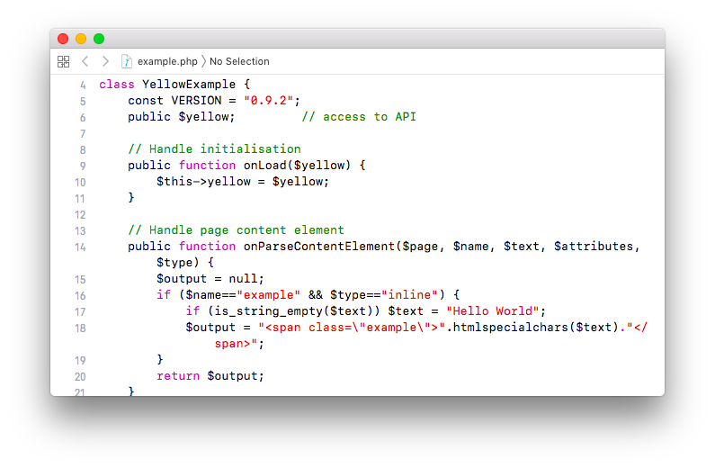

# Publish 0.9.10

Erweiterungen erstellen und veröffentlichen. Entwickelt von Anna Svensson.

## Wie man eine Erweiterung installiert

[ZIP-Datei herunterladen](https://github.com/annaesvensson/yellow-publish/archive/refs/heads/main.zip) und in dein `system/extensions`-Verzeichnis kopieren. [Weitere Informationen zu Erweiterungen](https://github.com/annaesvensson/yellow-update/tree/main/readme-de.md).

## Wie man eine Erweiterung erstellt

[Beginne mit einer Beispiel-Funktion](https://github.com/annaesvensson/yellow-example) oder [einem Beispiel-Theme](https://github.com/annaesvensson/yellow-stockholm) für Datenstrom Yellow. Schau dir am besten den Code von einigen Erweiterungen im `system/workers`-Verzeichnis an. Mach dich mit unseren Programmierstil vertraut. Dann kannst du in jede Erweiterung eintauchen und findest eine vertraute Struktur vor, in der du dich schnell zurecht findet. Für anspruchsvolle Erweiterungen gibt es eine [API für Entwickler](https://datenstrom.se/de/yellow/help/api-for-developers). Die [Erweiterungseinstellungen](#einstellungen-extension) sind in der Datei `extension.ini` gespeichert. Diese Erweiterungseinstellungen enthalten Informationen über alle Dateien die installiert werden sollen. Möchtest du eine Erweiterung erstellen? Erstelle ein neues Repository auf [Codeberg](https://codeberg.org/explore/repos?q=datenstrom-yellow&topic=true&sort=moststars), [GitHub](https://github.com/topics/datenstrom-yellow) oder einer der vielen Git-Hosting-Platformen. Lade die notwendigen Dateien hoch und füge das Thema `datenstrom-yellow` zu deinem Repository hinzu.

## Wie man eine Erweiterung verbessert

Du kannst deine Erweiterung verbessern und anderen Menschen zeigen. Das ist eine großartige Möglichkeit um Feedback zu erhalten und mit Funktionen zu experimentieren. Die meisten Erweiterungen beginnen experimentell mit `Status: experimental`. Im Laufe der Zeit bekommt man ein besseres Verständnis dafür was Menschen brauchen und kann experimentelle Erweiterungen verbessern. Gute Technologie wird für Menschen gemacht. Überprüfe deine Erweiterung aus der Perspektive des Benutzers. Stell dir vor was der Benutzer machen möchte und was dessen Leben einfacher machen würde. Denk daran dich auf Menschen zu konzentrieren. Nicht auf technische Details und viele Funktionen. Möchtest du Tipps zur Verbesserung deines Codes und deiner Dokumentation? Frage die Datenstrom-Netzgemeinschaft, [siehe Richtlinien zum Zusammenarbeiten](https://datenstrom.se/de/yellow/help/contributing-guidelines).

## Wie man eine Erweiterung veröffentlicht

Dieser Schritt ist nur für [Erweiterungen auf der offiziellen Webseite](https://datenstrom.se/de/yellow/extensions/) mit `Status: available` erforderlich. Für experimentelle Erweiterungen ist er optional. Durch das Veröffentlichen werden hauptsächlich die Erweiterungseinstellungen und Readme-Dateien aktualisiert. Durch das Veröffentlichen wird ausserdem der [Aktualisierungsmechanismus](https://github.com/annaesvensson/yellow-update/tree/main/readme-de.md) darüber informiert, dass eine neue Version einer Erweiterung verfügbar ist. Denke daran dass nur Erweiterungen die auf der offiziellen Webseite verfügbar sind in den Aktualisierungsmechanismus einbezogen werden.

Du kannst deine Erweiterung in der [Befehlszeile](https://github.com/annaesvensson/yellow-core/tree/main/readme-de.md) veröffentlichen. Stelle sicher, dass du die [Checkliste zur Selbstüberprüfung](self-review-checklist.md) ausfüllst und die `VERSION` im Code erhöhst bevor du eine Erweiterung veröffentlichst. Bist du bereit deine Erweiterung zu veröffentlichen? Öffne ein Terminalfenster. Gehe ins Installations-Verzeichnis, dort wo sich die Datei `yellow.php` befindet. Gib ein `php yellow.php publish all`. Du kannst wahlweise den Namen eines Verzeichnisses angeben. Das aktualisiert die notwendigen Dateien. Lade deine Änderungen hoch und erzeuge einen Pull-Request für das Repository `datenstrom/yellow`.

## Beispiele

Erweiterungseinstellungen für eine Funktion:

~~~
# Datenstrom Yellow extension settings

Extension: Example
Version: 0.9.2
Description: Example feature for Datenstrom Yellow.
Developer: Anna Svensson
Tag: example, feature
DownloadUrl: https://github.com/datenstrom/yellow-example/archive/refs/heads/main.zip
DocumentationUrl: https://github.com/datenstrom/yellow-example
Published: 2026-01-30 19:00:30
Status: experimental
system/workers/example.php: example.php, create, update
~~~

Erweiterungseinstellungen für eine Sprache:

~~~
# Datenstrom Yellow extension settings

Extension: German
Version: 0.9.5
Description: German language.
Translator: David Fehrmann
Tag: language
DownloadUrl: https://github.com/annaesvensson/yellow-language/raw/main/downloads/german.zip
DocumentationUrl: https://github.com/annaesvensson/yellow-language/tree/main/translations/german
Published: 2025-12-19 01:22:34
Status: available
system/workers/german.php: german.php, create, update
~~~

Erweiterungseinstellungen für ein Theme:

~~~
# Datenstrom Yellow extension settings

Extension: Stockholm
Version: 0.9.5
Description: Stockholm is a clean theme.
Designer: Anna Svensson
Tag: example, theme
DownloadUrl: https://github.com/annaesvensson/yellow-stockholm/archive/refs/heads/main.zip
DocumentationUrl: https://github.com/annaesvensson/yellow-stockholm
DocumentationLanguage: en, de, sv
Published: 2025-10-02 00:07:19
Status: available
system/workers/stockholm.php: stockholm.php, create, update
system/themes/stockholm.css: stockholm.css, create, update, careful
system/themes/stockholm.png: stockholm.png, create
system/themes/stockholm-opensans-bold.woff: stockholm-opensans-bold.woff, create, update, careful
system/themes/stockholm-opensans-light.woff: stockholm-opensans-light.woff, create, update, careful
system/themes/stockholm-opensans-regular.woff: stockholm-opensans-regular.woff, create, update, careful
~~~

Vorhandene Verzeichnisse in der Befehlszeile anzeigen:

`php yellow.php publish`  

Alle Verzeichnisse in der Befehlszeile veröffentlichen:

`php yellow.php publish all`  

Erweiterungen in der Befehlszeile veröffentlichen:

`php yellow.php publish yellow-example`  
`php yellow.php publish yellow-language`  
`php yellow.php publish yellow-stockholm`  

## Einstellungen

Die folgenden Einstellungen können in der Datei `system/extensions/yellow-system.ini` vorgenommen werden:

`PublishCodeDirectory` = Verzeichnis mit dem Code der veröffentlichten Erweiterungen  
`PublishWebsiteDirectory ` = Verzeichnis mit den Dateien der offiziellen Webseite  

Die folgenden Einstellungen können in der Datei `extension.ini` vorgenommen werden:

`Extension` = Name der Erweiterung  
`Version` = Versionsnummer der Erweiterung  
`Description` = Beschreibung der Erweiterung, ein kurzer Satz  
`Developer` = verantwortlicher Entwickler einer Funktion, durch Komma getrennt  
`Designer` = verantwortlicher Designer eines Themes, durch Komma getrennt  
`Translator` = verantwortlicher Übersetzer einer Sprache, durch Komma getrennt  
`Tag` = Tags zur Kategorisierung der Erweiterung, durch Komma getrennt  
`DownloadUrl` = Adresse zum Herunterladen der Erweiterung  
`DocumentationUrl` = Dokumentation der Erweiterung  
`DocumentationLanguage` = Dokumentationssprachen der Erweiterung, durch Komma getrennt  
`Published` = Veröffentlichungsdatum der Erweiterung, JJJJ-MM-TT Format  
`Status` = Status der Erweiterung, [unterstützte Statuswerte](#einstellungen-status)  

Die folgenden Erweiterungs-Statuswerte werden unterstützt:

`experimental` = Erweiterung ist experimentell, Nutzung auf eigene Gefahr  
`available` = Erweiterung ist verfügbar und [wird auf der offiziellen Webseite angezeigt](https://datenstrom.se/de/yellow/extensions/)  
`unmaintained ` = Erweiterung wird nicht mehr gepflegt  
`unassembled` = Erweiterung wird durch Werkzeugkette zusammengebaut  

Die folgenden Dateiaktionen werden unterstützt:

`create` = Datei erstellen falls nicht vorhanden  
`update` = Datei überschreiben falls vorhanden  
`delete` = Datei löschen falls vorhanden  
`optional` = nur bei Neuinstallation  
`additional` = nur nach Neuinstallation  
`careful` = nur falls nicht verändert  
`compress` = ZIP-Datei aus dem angegebenen Verzeichnis erstellen  
`multi-language` = Inhaltsdatei aus dem entsprechenden Verzeichnis verwenden  

Hast du Fragen? [Hilfe finden](https://datenstrom.se/de/yellow/help/).
